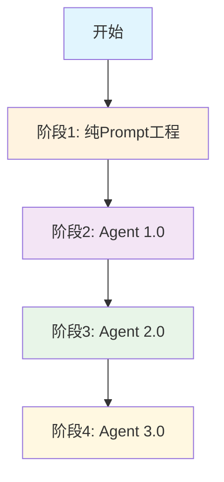
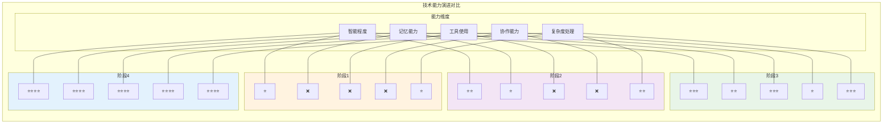
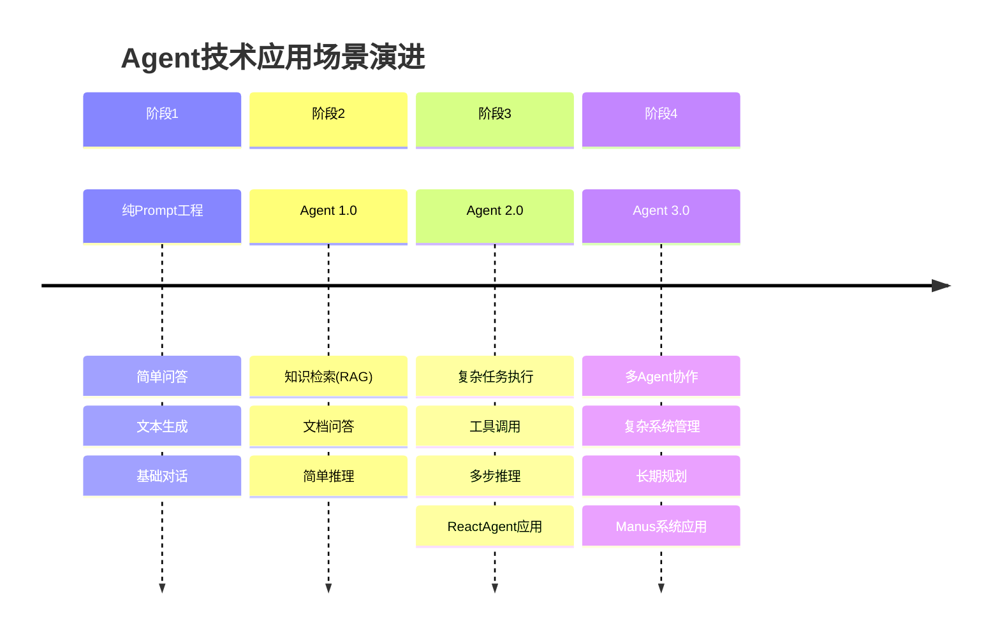

# Agent技术演进图示

## 技术演进概览

## 详细演进架构

```mermaid
graph TB
    %% 阶段1：纯Prompt工程
    subgraph Stage1 ["🔸 阶段1: 纯Prompt工程"]
        direction TB
        LLM1[大语言模型<br/>LLM]
        PROMPT1[提示词<br/>Prompt]
        
        LLM1 --> PROMPT1
        PROMPT1 --> OUTPUT1[输出结果]
        
        style LLM1 fill:#ffeb3b,stroke:#f57f17,stroke-width:2px
        style PROMPT1 fill:#ff9800,stroke:#e65100,stroke-width:2px
        style OUTPUT1 fill:#4caf50,stroke:#2e7d32,stroke-width:2px
    end
    
    %% 阶段2：Agent 1.0
    subgraph Stage2 ["🔸 阶段2: Agent 1.0 - RAG应用"]
        direction TB
        LLM2[大语言模型<br/>LLM]
        PROMPT2[提示词<br/>Prompt]
        MEMORY2[有限记忆<br/>Limited Memory]
        
        LLM2 --> PROMPT2
        PROMPT2 --> MEMORY2
        MEMORY2 --> OUTPUT2[RAG应用输出]
        
        style LLM2 fill:#ffeb3b,stroke:#f57f17,stroke-width:2px
        style PROMPT2 fill:#ff9800,stroke:#e65100,stroke-width:2px
        style MEMORY2 fill:#9c27b0,stroke:#6a1b9a,stroke-width:2px
        style OUTPUT2 fill:#4caf50,stroke:#2e7d32,stroke-width:2px
    end
    
    %% 阶段3：Agent 2.0
    subgraph Stage3 ["🔸 阶段3: Agent 2.0 - ReactAgent"]
        direction TB
        THINK3[思考模型<br/>Thinking Model]
        QA3[问答模型<br/>Q&A Model]
        PROMPT3[提示词<br/>Prompt]
        TOOLS3[工具集<br/>Tools]
        MEMORY3[有限记忆<br/>Limited Memory]
        
        THINK3 --> QA3
        QA3 --> PROMPT3
        PROMPT3 --> TOOLS3
        TOOLS3 --> MEMORY3
        MEMORY3 --> OUTPUT3[ReactAgent输出]
        
        style THINK3 fill:#2196f3,stroke:#1565c0,stroke-width:2px
        style QA3 fill:#03a9f4,stroke:#0277bd,stroke-width:2px
        style PROMPT3 fill:#ff9800,stroke:#e65100,stroke-width:2px
        style TOOLS3 fill:#ff5722,stroke:#d84315,stroke-width:2px
        style MEMORY3 fill:#9c27b0,stroke:#6a1b9a,stroke-width:2px
        style OUTPUT3 fill:#4caf50,stroke:#2e7d32,stroke-width:2px
    end
    
    %% 阶段4：Agent 3.0
    subgraph Stage4 ["🔸 阶段4: Agent 3.0 - 多Agent系统"]
        direction TB
        PLAN4[全局规划模型<br/>Global Planning Model]
        REACT4[ReactAgent集群<br/>ReactAgent Cluster]
        LMEMORY4[超长记忆<br/>Long-term Memory]
        
        PLAN4 --> REACT4
        REACT4 --> LMEMORY4
        LMEMORY4 --> OUTPUT4[Manus多Agent系统]
        
        style PLAN4 fill:#673ab7,stroke:#4527a0,stroke-width:2px
        style REACT4 fill:#00bcd4,stroke:#00838f,stroke-width:2px
        style LMEMORY4 fill:#e91e63,stroke:#ad1457,stroke-width:2px
        style OUTPUT4 fill:#4caf50,stroke:#2e7d32,stroke-width:2px
    end
    
    %% 连接各个阶段
    Stage1 --> Stage2
    Stage2 --> Stage3
    Stage3 --> Stage4
    
    %% 阶段样式
    style Stage1 fill:#fff3e0,stroke:#ff8f00,stroke-width:3px
    style Stage2 fill:#f3e5f5,stroke:#7b1fa2,stroke-width:3px
    style Stage3 fill:#e8f5e8,stroke:#388e3c,stroke-width:3px
    style Stage4 fill:#e3f2fd,stroke:#1976d2,stroke-width:3px
```

## 技术能力对比

## 应用场景演进

## 技术架构总结

| 阶段 | 核心组件 | 典型应用 | 主要特点 |
|------|----------|----------|----------|
| 阶段1 | 大模型 + 提示词 | 基础对话 | 简单直接，无状态 |
| 阶段2 | 大模型 + 提示词 + 有限记忆 | RAG系统 | 具备检索能力 |
| 阶段3 | 思考模型 + 问答模型 + 提示词 + 工具 + 有限记忆 | ReactAgent | 多模态，工具集成 |
| 阶段4 | 全局规划模型 + ReactAgent + 超长记忆 | Manus多Agent系统 | 协作能力，长期记忆 | 